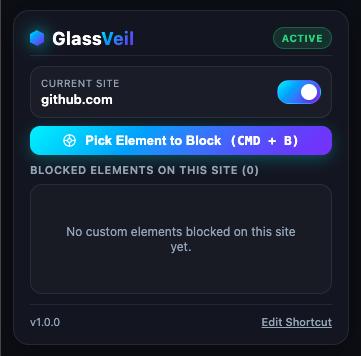
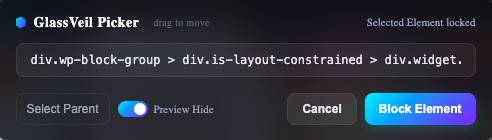
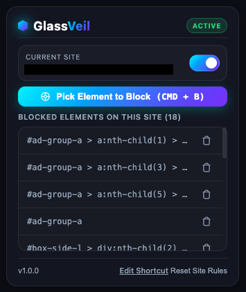

# GlassVeil Ads Blocker

GlassVeil Ads Blocker is a personal cosmetic ad-blocking Chrome extension that lets you manually pick and hide unwanted page elements such as ad banners, overlays, sticky boxes, and other distracting UI elements.

Instead of relying on predefined filter lists, GlassVeil gives you a visual element picker. Select an element on the current website, confirm the block, and GlassVeil will save a CSS rule for that domain.

## Features

- Visual element picker for selecting one or more page elements
- Cosmetic blocking using CSS rules
- Per-site blocking rules
- Enable or disable blocking for the current site
- View, delete, and reset saved rules from the popup
- Default keyboard shortcut.
  - macOS: `Cmd + B`
  - Windows/Linux: `Ctrl + B`
  - You can customize the shortcut from:
  ```text
  chrome://extensions/shortcuts
  ```
- Context menu shortcut: “Block element on this page”
- Shadow DOM based picker UI to reduce conflicts with website styles
- Local-only storage using Chrome extension storage

## Installation

### Load as an unpacked extension

1. Download or clone this repository.
  ```text
  git clone https://github.com/Peerapat-J/GlassVeil.git 
  ```
2. Open Chrome or another Chromium-based browser.
3. Go to: `chrome://extensions/shortcuts`
4. Enable Developer mode.
5. Click Load unpacked.
6. Select the GlassVeil project folder.
7. The GlassVeil icon should appear in your browser toolbar.

## Usage

### Block an element

1. Open the website where you want to hide an element.
2. Click the GlassVeil extension icon.
3. Click **Pick Element to Block**.


4. Hover over the page element you want to hide.
5. Click one or more elements to select them. Click a selected element again to remove it.
6. Optionally use:
   - **Select Parent** to block a larger container
   - **Preview Hide** to test the selected elements before saving
7. Click **Block Selected**.



The rule will be saved for the current domain.



### Toggle blocking for a site

Use the switch in the popup to enable or disable GlassVeil on the current website.

### Delete a saved rule

Open the popup and click the delete icon next to a saved selector.

### Reset all rules for a site

Click Reset Site Rules in the popup to remove all saved rules for the current domain.

### Use keyboard shortcut

To start the element picker.

Use: `Command + B` on macOS, 
or: `Ctrl + B` on Windows/Linux 


## Permissions

GlassVeil uses the following permissions:

- storage — save site rules and disabled site settings locally
- activeTab — interact with the current active tab
- scripting — inject scripts when needed
- contextMenus — provide the right-click “Block element on this page” action
- host permissions for http://*/* and https://*/* — allow the extension to run on normal websites

## Limitations

GlassVeil is a cosmetic blocker. It hides selected elements from view, but it does not prevent network requests from loading.

It cannot run on restricted browser pages such as:

` chrome:// edge:// about: `

Some websites may also change their HTML structure frequently, which can make previously saved selectors stop matching correctly.

## Privacy

GlassVeil stores rules locally in your browser using Chrome extension storage.

It does not require an account, does not send your saved rules to a server, and does not use a remote filter list.
